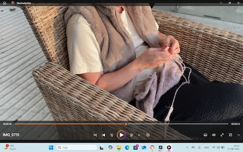

<!DOCTYPE html>
<html lang="da">
  <head>
    <meta charset="UTF-8" />
    <meta name="viewport" content="width=device-width, initial-scale=1.0" />
    <title>Visitkort Olivia</title>
  </head>
  <body>
    <h1>OLIVIA</h1>
    
    <h3>Lidt om mig</h3>
    

      Jeg hedder Olivia. Jeg er vokset op i sverige, og taler derfor flydende
      svensk. Mine forældre er danske og derfor taler jeg også flydende dansk.
    

    

      Grundet min opvækst er min familie fordelt over sverige og danmark, bl.a.
      min far og bror i sverige og min mor og søster i danmark.
    

    <h3>Ting jeg kan lide at lave</h3>
    

      Jeg kan lide at strikke. Jeg kan lide at læse. Jeg kan lide at lave mad.
      Jeg <em>elsker</em> naturen.
    

    
    <h3>SoMe</h3>
    <ul>
      <li>Facebook: Olivia Fandrup Visholm</li>
      <li>Instagram: Oliviavisholm</li>
    </ul>
    <h3>Kontakt Oplysninger</h3>
    <ul>
      <li>Email: Oliviafvisholm@hotmail.com</li>
      <li>Skole Email: Olvi0002@stud.ek.dk</li>
      <li>Tlf: +45 42 91 95 10</li>
    </ul>
  </body>
</html>
